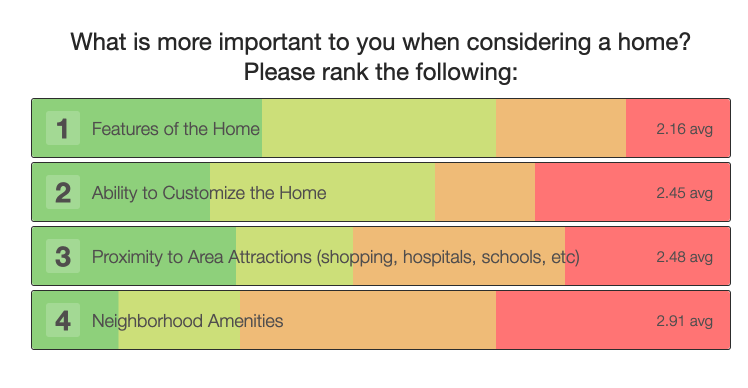
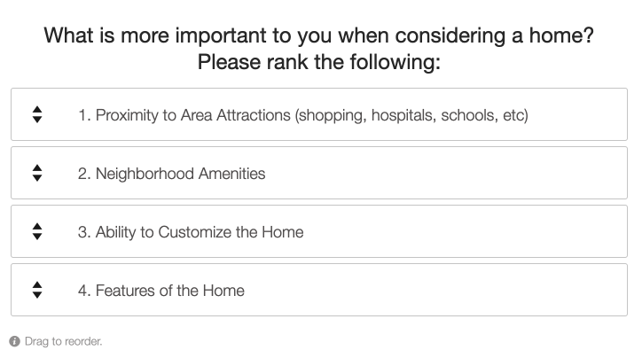

# Do people shop for a home or a neighborhood?

The company I worked for built huge neighborhoods - "communities" as they say in the biz. The company was responsible for building the individual home, the streets, any community amenities (pool, playground, clubhouse, etc) and all of the surrounding homes. The communities would take anywhere from 2-10 years to complete based on how quickly the homes sold.

As the person responsible for optimizing/personalization of the website for home shoppers, I often wondered if the home or the neighborhood was the priority. In all of the research we had done, we knew that personalizing the home was important (that was what the company specialized in) and we also knew that proximity to shopping, fire/police and where shoppers worked was important.

What we _didn't_ know was whether people fell in love with a home and then justified their way into the neighborhood or if they fell in love with the neighborhood and were content enough with a home. At the end of the day, without selling homes, we couldn't sell anything so we prioritized the business needs.

I wanted to see _some_ data so we could hedge one way or the other if needed. I quickly posted a survey on our site. It rolled out to 15% of site traffic, I didn't want to bother everyone and within a few weeks we had about 200 responses and the results had stabilized for a little bit.

The results weren't revolutionary, but it was enough to proceed with selling _homes_ within neighborhoods.

Figure 1. Survey participants were asked to order these options based on their priority.

Figure 2. Survey results demonstrated that users ranked items related to the house higher than items related to the neighborhood.

---
#### Background:
Between 2015-2020 I was responsible for all A/B testing, personalization and optimization for a luxury homebuilder’s website. The website’s “job” was to get users in touch with a sales person. The internet was very different back in the late teens and much of this technology is standard now, back then it wasn’t and required lots of people. I have sanitized this and won’t use real numbers so as not to share any proprietary information about the company. This post is about how I made the site better for people shopping for a home.